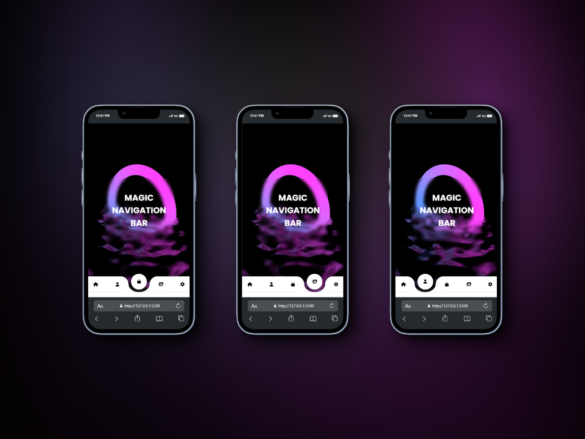

  

<h1 align="center">
  Magic Navigation Bar
</h1>

  
  
  

This project is a simple navigation bar created using HTML, CSS, and JavaScript. It allows users to navigate between different sections of a website with ease.

## ❤️ Credits

This project has been possible. Special thanks to [Luna Dev Code](https://www.youtube.com/@lundeveloper). 

## ✍🏻 Author

- [@Aoudumber-Bade](https://github.com/Aoudumber-Bade)

Made with ❤️ Aoudumber Bade

